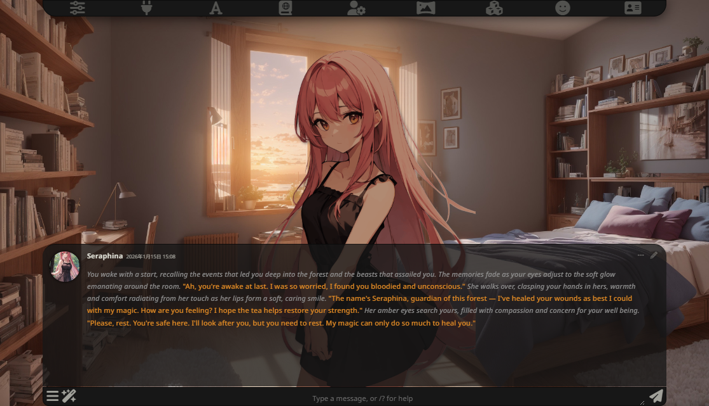
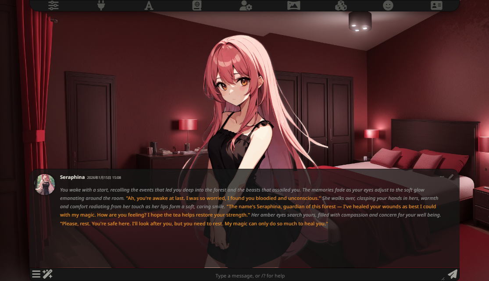
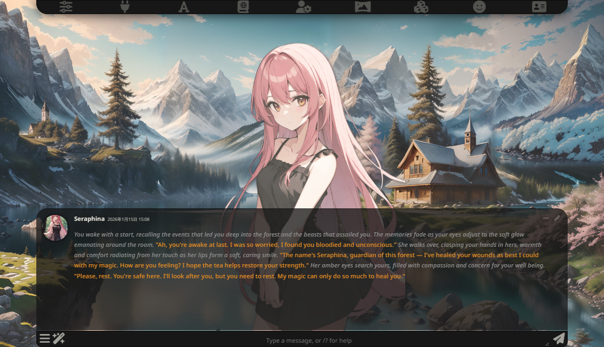
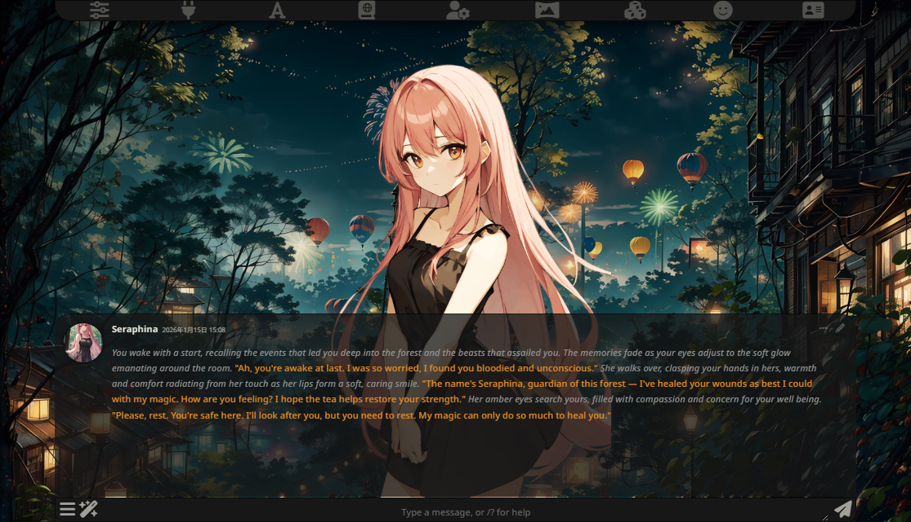

# 🎨 SillyTavern Chara Color Filter

An extension for SillyTavern that automatically applies a color filter to character sprites based on the background's average color.
It helps characters blend into the scene naturally, creating a more immersive experience!

## ✨ Features
* **Auto-Blending**: Automatically detects the background image's average color and tints the character sprite.
* **Blend Modes**: Supports various blend modes (Overlay, Multiply, Soft Light, etc.) via the extension settings.
* **Persist Settings**: Remembers your preferred blend mode even after reloading.
* **Non-Destructive**: Select "None" to instantly revert to the original look.
* **Performance Friendly**: Uses debounce and efficient observers to minimize impact.

## 📥 Installation
1.  Open SillyTavern and navigate to **Extensions**.
2.  Click **Install Extension**.
3.  Paste the repository URL: `https://github.com/heikouidou/chara-color-filter`
4.  Click **Install**.

## 📖 Usage
1.  Once installed, the filter is applied automatically based on your background.
2.  Go to the **Extensions** menu > **Chara Color Filter**.
3.  Choose your preferred **Blend Mode** from the dropdown menu (e.g., Overlay, Multiply).
    * ​*Tip: Try different modes! "Overlay" is great for general lighting, while "Multiply" creates a moody atmosphere perfect for sunsets or darker scenes.*
 

 
 
 

## 🤝 Credits
* **Developer**: parallel1l1l
* **Technical Advisor**: AI (Gemini)

---
*Created with ❤️ for the SillyTavern community.*

